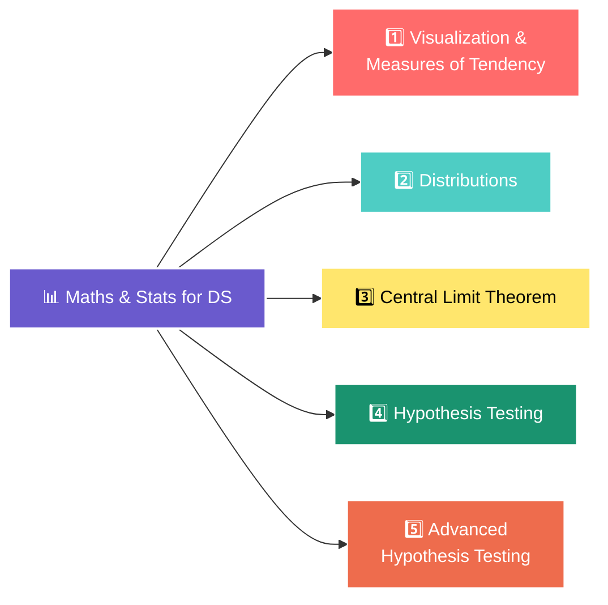

<div align="center">

# 📊 Maths & Statistics for Data Science

### *A hands-on, notebook-driven journey through the statistical foundations every data scientist needs*


</div>

---

## ✨ About This Repository

This repo is a **chapter-wise collection of Jupyter notebooks, spreadsheets, and datasets** covering the core mathematical and statistical concepts that power data science — from basic visualizations all the way to advanced hypothesis testing. Each folder pairs a **concept** with **real-world style datasets** (heights, stock returns, exam scores, A/B tests, churn data, and more) so the theory is always grounded in practice.

> 🎯 Inspired by the *Maths & Statistics for Data Science* course on **codebasics.io**, with personal practice notebooks and solved exercises added along the way.

---

## 🗂️ Repository Structure

<div align="center">



</div>

---

## 1️⃣ Visualization & Measures of Central Tendency
📁 `1_Visualization_Measure_Of_Tendency/`

| Topic | Folder | Highlights |
|---|---|---|
| 📈 **Visualization Basics** | `1_visualization` | Line charts, histograms, scatter plots & expenses vs Apple revenue (Excel) |
| 🎯 **Mean, Median, Mode** | `2_mean_median_mode` | Movie stats — central tendency in action |
| 📐 **Percentiles** | `3_percentile` | Percentile-based data interpretation |
| 👟 **Shoe Sales Analysis** | `4_shoe_sale_analysis` | Real dataset + telecom churn exercise with full solutions |
| 🔗 **Correlation** | `10_correlation` | Relationship strength between variables |
| 📦 **Box Plots** | `6_box_plot` | Math scores & multi-subject score distributions |
| 🚨 **Outlier Detection (IQR)** | `7_outlier_detection_using_iqr_boxplot` | Using IQR + box plots to clean height data |
| 📊 **Variance & Std Dev** | `8_variance_stddev` | Spread of data — variance from scratch |
| 📉 **Stock Returns & Volatility** | `9_stock_returns_volatility` | Cricket scores & stock returns volatility |
| 🌍 **Climate Stability Exercise** | `chapter4_exercise3` | Assignment + fully solved climate analysis |

---

## 2️⃣ Distributions
📁 `2_Distributions/`

| Topic | Folder | Highlights |
|---|---|---|
| 📐 **Skewness** | `2_skewness` | Detecting left/right skewed data |
| 🔔 **Normal Distribution** | `3_normal_distribution` | Heights dataset — 68-95-99.7 rule explained |
| 🚨 **Outliers via Normal Dist.** | `4_detect_outliers_using_normal_distribution` | Identifying & removing extreme height values |
| 🧮 **Z-Score** | `5_z_score` | Standardizing data & outlier removal |
| 📏 **Standard Normal Distribution** | `6_snd` | Converting raw scores to z-distribution |
| ⚽ **Sports League Exercise** | `chapter5_exercise1` | Outlier detection — solved exercise |
| 👔 **Employee Work Hours Exercise** | `chapter5_exercise2` | Distribution analysis — solved exercise |

---

## 3️⃣ Central Limit Theorem
📁 `3_Central_limit_Theorem/`

| Topic | Folder | Highlights |
|---|---|---|
| ☀️ **CLT — Solar Panel Survey** | `4_clt_solar_panels_coding` | 207 cities × 50 samples → sampling distribution of the mean |
| 🚗 **Confidence Interval — Car Miles** | `8_Confidence Interval Estimate Car Miles` | Confidence interval estimation + retail sales exercise |

---

## 4️⃣ Hypothesis Testing
📁 `4_Hypothesis_testing/`

| Topic | Folder | Highlights |
|---|---|---|
| 💊 **A/B Testing (Z-Test)** | `11_z_test_AB_testing_coding` | Drug effectiveness A/B test + UI design conversion exercise |
| 🏠 **Z-Test — Housing Inflation** | `3_z_test_housing_inflation` | One-tailed Z test on housing price increases |
| 📐 **P-Value Coding** | `5_p_value_coding` | Computing & interpreting p-values + sales data exercise |
| ↔️ **One-Tailed vs Two-Tailed** | `6_one_tailed_two_tailed` | Side-by-side comparison of test types |

---

## 5️⃣ Advanced Hypothesis Testing
📁 `5_Advanced_hypothesis_testing/`

| Topic | Folder | Highlights |
|---|---|---|
| 🎓 **T-Test — Exam Scores** | `12_2_case_study_exam_score` | Teaching method impact via rejection region & p-value |
| 🎲 **Chi-Squared Goodness of Fit** | `12_4_test_of_goodness_of_fit` | Phone sales vs expected distribution |
| 📱 **Chi-Squared Test of Independence** | `12_5_test_of_independence` | Phone type vs age group dependency |

---

## 🧰 Tech Stack

<div align="center">


**Core Libraries:** `pandas` • `numpy` • `matplotlib` • `seaborn` • `scipy.stats`

</div>

---

## 🚀 Getting Started

```bash
# 1. Clone the repository
git clone https://github.com/rushikreddie/Maths-and-Statistics-for_Data_Science.git
cd Maths-and-Statistics-for_Data_Science

# 2. Install the essentials
pip install pandas numpy matplotlib seaborn scipy jupyter openpyxl

# 3. Fire up Jupyter and explore any chapter
jupyter notebook
```

---

## 📚 Concepts Covered at a Glance

✅ Data Visualization (line, scatter, histogram, box plot)
✅ Mean, Median, Mode, Percentiles
✅ Variance, Standard Deviation, Correlation
✅ Skewness & Normal Distribution
✅ Z-Score & Standard Normal Distribution
✅ Central Limit Theorem & Confidence Intervals
✅ Z-Test (one-tailed & two-tailed), P-Values
✅ T-Test, Chi-Squared (Goodness of Fit & Independence)
✅ A/B Testing for real-world decision making

---

<div align="center">

### ⭐ If this helped you understand stats better, consider starring the repo!


</div>
